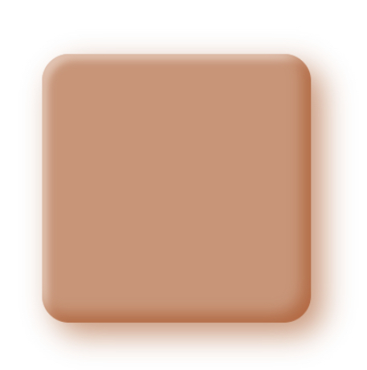

# Claymorphism: Fluffy, soft 3D Styling for Websites

<[css
<[style
<[shadow
<[3D

<°Claymorphism is a specific styling method utilizing pastel colours and box-shadows to create a fluffy and soft 3D effect for Html elements.°>

[https://blog.openreplay.com/implementing-claymorphism-with-css/]

Example Element:

```html
<div class=“clay”></div>
```

```css
.clay {
    width: 300px;
    height: 300px;
    border-radius: 30px; 
    background: rgba(165, 79, 29, 0.6);
    box-shadow: inset -0.6em -0.6em 1em rgba(165, 79, 29, 0.6), inset 0.4em 0.4em 0.5em rgba(245, 230, 221, 0.6), 0.8em 0.8em 2em rgba(165, 79, 29, 0.6);
}
```

